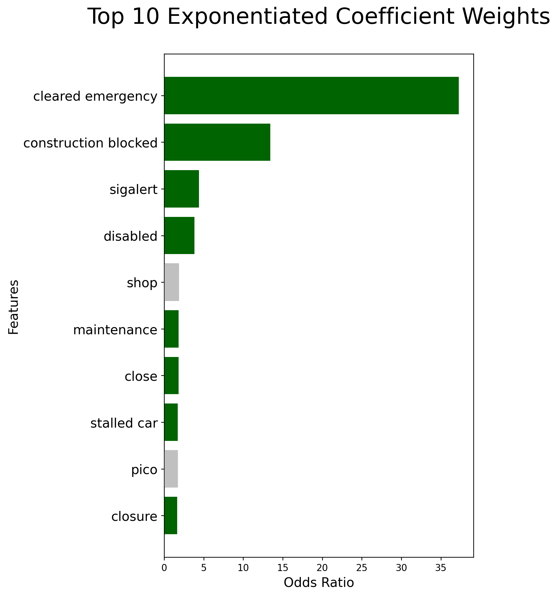
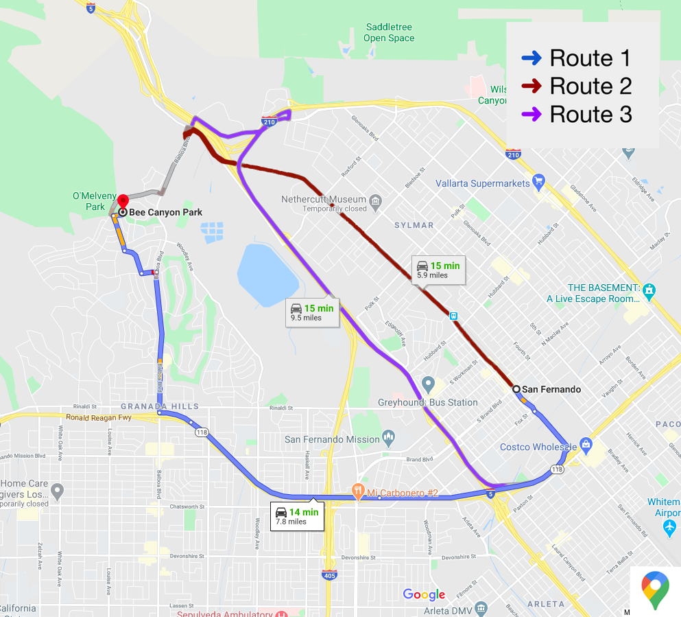

# Optimizing first responder routes using real-time social media information

Team: Samuel Hawkes, Dina Bahar, Ramin Vafadary

## Problem Statement

In the modern era it is possible for information to travel faster via a social media platform than through official news outlets. Our client, American Medical Response (AMR), wants to improve response times for rescue crews during a natural disaster or crisis.  To this end we propose to evaluate whether Twitter posts can be used effectively to identify potential traffic problems in real-time for first-responders during an emergency.  


## Methods

To achieve this goal we have split the problem into two parts, a feasibility study to detect vocabulary changes on Twitter during an incident and a specific use case study to use Twitter posts to evaluate potential risks along a Google maps route.

**Part A. Feasibility Study**

Using Twitter data, NLP, and Logistic Regression, can we detect the most common words people use to tweet about traffic incidents?
   1. Choose a traffic incident (roadwork, closure, accident, etc)
   2. Use HERE.com incident report as Twitter query keywords to scrape posts from before and after the incident
   3. Set target label as 0 for posts before incident and 1 for posts during and after the incident
   4. Run a suite of logistic regression models to predict whether a tweet came after a road incident
   5. Evaluate text features with strongest predictive capability
   
**Part B. Use Case**

Can Twitter posts be used to identify potential traffic problems in real-time during an emergency?  
1. Set origin and destination in Google maps and get step by step instructions
2. Use roads and intersections as query terms to search Twitter
3. Cross reference collected Twiter posts with text features extracted from Part A
4. Evaluate whether any of the Google maps routes is likely to have a traffic hazard

## Table of Contents

The table below outlines the notebooks in this repository as well as their purpose in the process.  All of these can be run as is, but if you want to customize the process you can find detailed instructions on what to edit below the table.

| Notebook Name | Purpose | Notes |
| - | - | - |
| 01_here_traffic_scraper.ipynb | This notebook is for collecting traffic incident data from HERE.com and was used to collect data for the feasibility study| You will need a HERE.com API key to run this |
| 02_twitter_incident_scarper.ipbynb | This notebook is used for collecting twitter data using a list of query terms and a pair of dates to scrape from and until | No API key necessary, but you will need getoldtweets3 |
| 03_combine_incidents_data.ipynb | This notebook is used to combine Twitter posts from multiple incidents from different time windows | You will need to have two CSV files with data to run this notebook |
| 04_modeling.ipnb | This notebook reads in a corpus of Tweets and applies a CountVectorizer transformation on the text body and then runs a logistic regression model to predict whether the tweets came before or after an incdident | You will need to select a CSV file of tweets distributed around an incident to run this notebook |
| 05_case_study_saddleridge_fire.ipnb | This notebook is used to query Google maps for a set of directions, extract the route segments, and use these query Twitter road hazards based on the incident keywords extracted from notebook number 4 | You will need a Google Maps API key and starting and ending points for the map query |


**Customize Feasibility Study**

To run your own feasibility study you will need to first use notebook 01 to select your incident(s) to study, then use notebook 02 to collect tweets from the time region of interest using query terms related to the incident, then use notebook 03 if you need to combine data from multiple incidents, then use notebook 04 to model the data and extract features.

**Use Case Study**

To run your own use case study you will use notebook 05 and then you will input a starting and ending location and a date range for which to collect Twitter data over.


Software Requirements
---
If interested in reproducing this project, you need the following softwares,

To perform data manipulation, analysis, and modeling:

1. Pandas
2. Scikit-learn

To visualize your findings:

3. Matplotlib
4. Seaborn

To collect HERE.com, Twitter, and Google Maps data respectively:

5. HERE.com API
6. GetOldTweets3
7. Google Maps API

## Data

The data for both parts of this project consist of text documents pulled from Twitter.  For Part A the tweets are selected from a time period centered on a specific known incident case and are evenly distributed before and after to achieve the best balance of classes. The query terms are drawn from the incident descriptions on HERE.com for traffic problems on the I-10, I-5, and CA-2 in the greater Los Angeles region.

For part B the data is also from Twitter but the query words are drawn from a set of step by step Google maps instructions from the San Fernando Fire Department to the Saddleridge fire.  The streetnames from each of the three routes are used to query Twitter for posts that may relate to closures along the first responder path.


## Results

**Part A. Feasibility Study**

Starting from a baseline score of 56% we are able to predict with 71% accuracy whether a tweet came before or after a known traffic incident. We get the same score on both the training and testing subgroups which shows that we have a low variance and highly generalizeable model.  This is ideal because the goal of this feasibility study is to extract the word coefficients from the logistic regression model so they can be used as keywords to detect traffic concerns in real time.  For example, the top 10 words with the highest coefficients are shown below:



While a few of these are clearly noise (eg. shop, pico) most of them relate to realtime traffic problems.  This allows us to conclude that we can actually use Twitter to detect traffic incidents in real time.  For the next step we will extract these high coefficient keywords and cross reference them with Twitter posts relating to a set of Google maps directions.

List of coefficient keywords:

```
['cleared emergency',
 'construction blocked',
 'sigalert',
 'disabled',
 'maintenance',
 'close',
 'stalled car',
 'closure',
 'stop',
 'crash blocking',
 'restriction',
 'police activity',
 'closed',
 'disabled vehicle',
 'collision unkn',
 'collision unkn incident',
 'new planned construction',
 'congestion 345',
 'congestion 345 28',
 'construction',
 'cleared planned construction',
 'cleared planned',
 'construction blocked 05',
 'construction ramp',
 'expect delays',
 'emergency construction blocked',
 'emergency',
 'injuries']
```

**Part B.  Use Case Study**

The map below shows route options put into Google maps to test for road hazards on the way from the San Fernando fire department to Bee Canyon Park, near the site of the Saddleridge Fire.



The table below shows the number of Tweets that were flagged using the keyword list from Part A as possibly relating to road closures along each route to the fire. From this result we can conclude that Balboa Boulevard is the most likely to be clear while the route via I-5 and I-210 is most likely to have a closure or blockage.


|         |   Route Details  | No. of Tweets About Closed Roads |
|---------|:----------------:|---------------------------------:|
| Route 1 |    118 Freeway   |                                7 |
| Route 2 | Balboa Boulevard |                                0 |
| Route 3 |   I-5 and I-210  |                               57 |


## Conclusions

**1. Can we detect the most common words people use to tweet about traffic incidents?**

- Yes, real-time traffic incidents are systematically reflected in Twitter posts such that we can use the vocabulary to predict whether a tweet came before or after an incident

**2. Can Twitter posts be used to identify potential traffic problems in real-time during an emergency?**

- Yes, we can search Twitter for posts that reference streets on the route and evaluate them for incident keywords and evaluate each route segment for traffic hazards.

**Flaws:** 

- Most people don't tweet & drive 
- There are not a lot tweets regarding street routes
- There are no hashtags for an emergency that is actively unfolding
- There is a lot of noise in the text data that is unrelated to traffic

## Recommendations

Our model's 71% accuracy on seen and unseen data shows promise, but there are some steps to improve accuracy:
- Purchasing the paid tier of HERE.com to collect more (verified) incident data
- Incoporate Twitter hashtags in our model
Also, to minimize encountering traffic congestions, we recommend AMR to employ local drivers with extensive neighborhood knowledge for maximum efficiency in case of emergency.